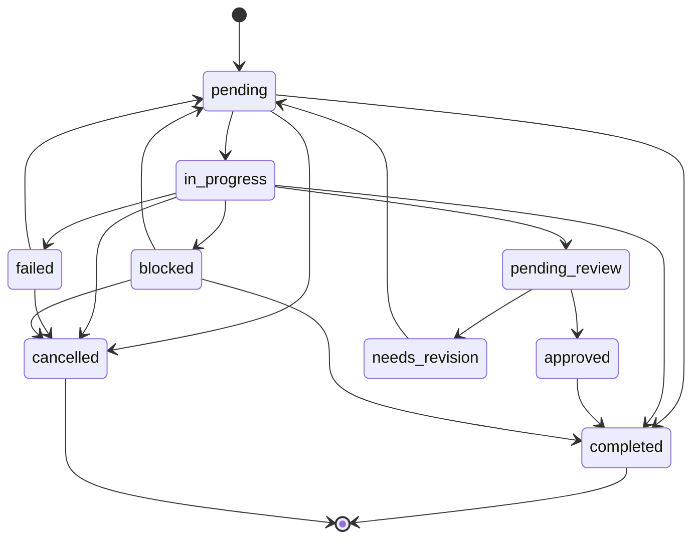

# Task Orchestrator MCP Server

**Infrastructure Moat First — the stateful task engine + AI-native tool registry + Model Router for MCP**

Task Orchestrator is an MCP (Model Context Protocol) server that gives AI agents persistent, auditable task infrastructure. It stores goals as task trees in SQLite, enforces valid state transitions via a deterministic state machine, provides full-text tool search through FTS5, and routes tasks to optimal models through a zero-LLM keyword-based rule engine. No embedded LLM — the server's value is infrastructure that no model upgrade can absorb.

**Design Philosophy:** Model-layer features (prompt engineering, reflection heuristics, auto-decomposition) are absorbed by Anthropic/OpenAI within 6 months. Infrastructure-layer features (persistent state, database triggers, state machine enforcement, full-text search, rule engine routing) are structurally defensible. The server provides the reliable substrate; AI agents bring their own intelligence.

---

## Quick Start

```bash
git clone https://github.com/your-org/task-orchestrator.git
cd task-orchestrator
npm install
npm run build
```

The server runs on stdio. On first launch it auto-creates the SQLite database (`data/orchestrator.db`), initializes schema (tasks, tools, audit_log, snapshots, archived_tasks, model_config), and seeds the default model router plan (Plan B — China models).

```bash
npm start
```

---

## Full API Reference

All 30 tools. Every tool returns `{ error: string }` on failure. Schema validation via Zod.

### Phase 1: Core Engine

| Tool | Description | Key Inputs | Returns |
|------|-------------|------------|---------|
| `task_plan` | Create a task plan — stores goal + decomposed subtasks as a tree in SQLite. Subtasks with `depends_on` start as `blocked`. | `goal`, `subtasks[]`, `context?` | `root_task`, `subtasks[]` |
| `task_next` | Get the next actionable task. Two modes: `executor` (pick pending with deps met) or `reviewer` (pick `pending_review`). | `task_id?`, `mode?`, `include_blocked?` | `next_task` (nullable), `summary` |
| `task_update` | Transition a task to a new status. Enforces valid transitions (see state machine). Auto-cascades parent completion when all siblings are done. | `task_id`, `status`, `result?`, `error?`, `review_comment?`, `tool_name?` | `task`, `parent_auto_completed?`, `parent_status?` |
| `task_reflect` | Gather execution history + heuristic suggestions (retry advice, review queue, blocked deps, success rate warnings). No LLM. | `task_id`, `goal?` | `task_tree[]`, `summary`, `suggestions[]` |
| `task_status` | View a task tree in `flat` or `tree` format. Defaults to latest root. | `task_id?`, `format?` | `root`, `tasks` (flat or nested tree) |

### Phase 2: Task Lifecycle

| Tool | Description | Key Inputs | Returns |
|------|-------------|------------|---------|
| `task_cancel` | Cancel a task and optionally cascade to all descendants. Only cancellable: `pending`, `in_progress`, `failed`, `blocked`. | `task_id`, `cascade?`, `reason?` | `cancelled`, `cascaded_count`, `reason` |
| `task_export` | Export a task tree recursively to JSON (nested tree) or CSV (flat rows). Creates parent directories automatically. | `task_id`, `filepath?`, `format?` | `exported_to`, `task_count` |
| `task_import` | Import a task tree from a JSON file (produced by `task_export`). Re-IDs all nodes, remaps `parent_id` and `depends_on`. Transactional. | `filepath` | `root_id`, `imported_count` |
| `task_duplicate` | Deep-clone an existing task tree. All tasks reset to `pending`, new UUIDs, remapped relationships. | `task_id` | `original_id`, `new_root_id`, `duplicated_count` |
| `task_batch_update` | Update multiple tasks atomically. Validates each transition individually — partial success allowed. | `task_ids[]`, `status`, `result?`, `error?`, `review_comment?` | `succeeded`, `failed`, `failures[]`, `cascaded_parent_count?` |
| `task_dependency_graph` | Visualize a task tree's dependency graph. Formats: `mermaid` (flowchart), `ascii` (text tree), `json` (nodes + edges). | `task_id?`, `format?` | `graph` (format-dependent), `format` |

### Phase 3: Tool Registry

| Tool | Description | Key Inputs | Returns |
|------|-------------|------------|---------|
| `tool_register` | Register a new tool in the AI-native tool registry. Syncs to FTS5 for full-text search. Platform growth mechanism. | `name`, `description`, `schema`, `provider`, `tags?` | Registered tool object |
| `tool_search` | Search the tool registry with natural language via FTS5 full-text search. Returns relevance-ranked results. Falls back to LIKE if FTS5 unavailable. | `query`, `limit?`, `tags?` | `results[]` (with `relevance_score`) |
| `tool_update` | Update tool metadata. Only provided fields are changed. Syncs FTS5 index on description/tag changes. | `name`, `description?`, `schema?`, `provider?`, `tags?` | Updated tool object |
| `tool_deprecate` | Deprecate a tool. Prefixes description with `[DEPRECATED]`, removes from FTS5 index. Data preserved in DB. | `name`, `replacement?` | Deprecated tool info |
| `tool_export` | Export all registered tools to a JSON file. Optionally include deprecated tools. | `filepath?`, `include_deprecated?` | `exported_to`, `tool_count` |
| `tool_import` | Bulk import tools from a JSON array. Modes: `merge` (upsert) or `replace` (clear first). Syncs FTS5. | `filepath`, `mode?` | `imported`, `skipped`, `errors[]` |
| `tool_stats` | Registry statistics: total/deprecated/active counts, per-provider breakdown, top tags, recently added. Read-only. | _(none)_ | `total`, `deprecated`, `active`, `per_provider[]`, `top_tags[]`, `recently_added[]` |

### Phase 4: Quality & Accountability

| Tool | Description | Key Inputs | Returns |
|------|-------------|------------|---------|
| `task_audit_log` | Retrieve task status change history. Powered by SQLite triggers (`AFTER UPDATE OF status`). Filter by task_id or browse globally. | `task_id?`, `limit?` | `entries[]` (old_status, new_status, changed_at) |
| `task_metrics` | Aggregate metrics across ALL task trees: avg completion rate, avg time, most failed titles, avg retries, review ratio, status breakdown. Read-only. | _(none)_ | Full metrics object (see types.ts) |
| `task_rollback` | Revert a task to its previous status using the audit log. Cannot rollback terminal states (`completed`, `cancelled`). Inserts rollback audit entry. | `task_id` | `task_id`, `rolled_back_from`, `rolled_back_to` |
| `task_snapshot` | Create a point-in-time snapshot of an entire task tree. Stores full recursive JSON in the `snapshots` table. Git-like versioning for task trees. | `task_id`, `label?` | `snapshot_id`, `task_count`, `created_at` |

### Phase 5: Data Lifecycle

| Tool | Description | Key Inputs | Returns |
|------|-------------|------------|---------|
| `task_archive` | Archive a completed/approved task tree. Moves to `archived_tasks`, cleans up snapshots + audit log + depends_on refs. Cascade required for non-leaf nodes. | `task_id`, `cascade?` | `archived`, `title`, `subtrees_archived`, `archived_at` |
| `task_archive_list` | List archived tasks with optional status filter and pagination. | `status?`, `limit?`, `offset?` | `tasks[]`, `total` |
| `task_archive_restore` | Restore an archived task tree back to active tasks. Validates parent/dep references, fails on ID conflicts. | `task_id`, `cascade?` | `restored`, `title`, `subtrees_restored` |

### Phase 5.5: Model Router

| Tool | Description | Key Inputs | Returns |
|------|-------------|------------|---------|
| `model_classify` | Classify a task description into 1 of 8 categories via keyword-based rule engine. Zero LLM dependency. Returns confidence + all category scores. | `task_description` | `category`, `category_name`, `confidence`, `matched_keywords[]`, `all_scores[]` |
| `model_route` | Route a task to the best model. Classifies internally, then matches against available models using active plan presets. Falls back gracefully. | `task_description`, `available_models?`, `plan_preset?` | `model`, `category`, `confidence`, `reason`, `estimated_cost_per_1M`, `plan_used` |
| `model_config` | Manage model routing configuration. Actions: `list` (view active plan + mappings), `switch` (change plan), `set` (override category model), `reset` (restore defaults). Pure CRUD. | `action`, `plan?`, `category?`, `primary_model?`, `fallback_model?` | Depends on action (see types.ts) |

### Phase 7: System

| Tool | Description | Key Inputs | Returns |
|------|-------------|------------|---------|
| `system_info` | Database infrastructure stats: table row counts, DB file size, WAL status, journal mode, checkpoint info. Read-only introspection. | _(none)_ | `total_tasks`, `total_tools`, `total_snapshots`, `total_audit_log_entries`, `database_file_size_bytes`, `journal_mode`, `wal_exists`, `shm_exists`, `table_row_counts` |
| `data_integrity_check` | Scan the database for 10 categories of issues: invalid statuses, orphan parents, broken depends_on refs, circular dependencies, retry overflow, orphan snapshots, etc. Optionally auto-repair. | `repair?` | `issues_found`, `issues[]`, `healthy`, `repair_applied?` |

---

## State Machine

The state machine enforces valid transitions on every `task_update` and `task_batch_update` call. Invalid transitions return a clear error with the list of allowed next states.



**Key behaviors:**
- `completed` and `cancelled` are terminal — no further transitions allowed
- `needs_revision` bumps `retry_count` and routes back to `pending` (Agent A re-executes)
- Parent auto-cascade: when all siblings reach `completed`/`approved`, the parent auto-transitions to `completed` recursively up the chain
- `blocked` tasks auto-resolve to `pending` when all dependencies complete
- Subtasks with `depends_on` specified at plan creation start as `blocked`

---

## Dual-Review Workflow

Task Orchestrator supports a two-agent review pattern without any LLM coordination:

1. **Agent A (Executor):** `task_next(mode=executor)` picks the next pending task with dependencies met
2. Agent A executes the task, then: `task_update(task_id, status=pending_review, result=...)`
3. **Agent B (Reviewer):** `task_next(mode=reviewer)` picks tasks waiting for review (sorted by priority)
4. Agent B reviews and decides:
   - **Approve:** `task_update(task_id, status=approved)` — cascades to `completed`
   - **Reject:** `task_update(task_id, status=needs_revision, review_comment=...)` — bumps retry_count, routes back to Agent A's queue
5. **Auto-cascade:** when all subtasks of a parent are approved/completed, the parent auto-completes

This is enforced entirely by the state machine — no agent-to-agent communication, no shared memory, no LLM coordination needed. The database is the coordination layer.

---

## Model Router

A zero-LLM keyword-based rule engine that classifies tasks into 8 categories and routes them to optimal models per plan. No embedded LLM — pure deterministic matching.

### Classification Engine (`model_classify`)

8 categories with Chinese keyword matching:
| Category | Name | Example Keywords |
|----------|------|-----------------|
| `high_logic` | 高邏輯推理 | 分析, 評估, 推理, 策略, 規劃 |
| `code_generation` | 代碼生成 | 代碼, 編程, debug, Vibe Coding |
| `creative_writing` | 創意寫作 | 創作, 故事, 文案, 寫作 |
| `info_reading` | 資訊閱讀 | 總結, 摘要, 翻譯, PDF, 閱讀 |
| `simple_repeat` | 簡單重複 | 格式化, 批量, 轉換, 整理 |
| `image_understanding` | 圖片理解 | 圖片, 截圖, OCR, 識別 |
| `image_generation` | 圖片生成 | 畫, 設計, 海報, 文生圖 |
| `video_audio` | 影片/音頻 | 影片, 音頻, 字幕, 語音 |

Weighted keyword matching + input pattern matching + output type matching. Fallback to `high_logic` on low confidence (<0.2) or if no keywords match.

### Plan A: International Models

| Category | Primary | Fallback | Output Cost/1M |
|----------|---------|----------|---------------|
| high_logic | claude-opus-4-7 | claude-sonnet-4-6 | $75 / $15 |
| code_generation | claude-sonnet-4-6 | gpt-5-4 | $15 / $15 |
| creative_writing | minimax-m2-5 | claude-sonnet-4-6 | $1.20 / $15 |
| info_reading | gemini-2-5-flash-lite | deepseek-v4-flash | $0.40 / $0.28 |
| simple_repeat | deepseek-v4-flash | gemini-2-5-flash-lite | $0.28 / $0.40 |
| image_understanding | claude-sonnet-4-6 | gemini-3-1-pro | $15 / $12 |
| image_generation | dall-e-4 | stable-diffusion-4 | ~$0.04-0.12/img |
| video_audio | gemini-3-1-pro | gpt-5-4 | $12 / $15 |

**Strategy:** Flagship models for complex reasoning + code; cheap models for reading + repeat tasks. Blend cost ~30-50% of always-strongest.

### Plan B: China Models (Default)

| Category | Primary | Fallback | Output Cost/1M |
|----------|---------|----------|---------------|
| high_logic | deepseek-v4-pro | glm-5-1 | ¥6 / ¥24 |
| code_generation | deepseek-v4-pro | kimi-k2-5 | ¥6 / free |
| creative_writing | minimax-m2-5 | deepseek-v4-pro | $1.20 / ¥6 |
| info_reading | deepseek-v4-flash | glm-4-flash | ¥2 / ¥1 |
| simple_repeat | deepseek-v4-flash | glm-4-flash | ¥2 / ¥1 |
| image_understanding | glm-4-6v | minimax-vl-01 | ¥2 |
| image_generation | cogview4 | doubao-seed-2 | ~¥0.1-0.3/img |
| video_audio | kling-2-6 | glm-4-voice | usage-based |

**Strategy:** Domestic models cost 1-2 orders of magnitude less than international. Use flagships aggressively. DeepSeek Pro at ¥6/1M (2.5折 promo through May 31, 2026).

### Plan C: GLM Lazy Mode

All GLM series — one ecosystem, no thinking required:

| Category | Primary | Fallback | Output Cost/1M |
|----------|---------|----------|---------------|
| high_logic | glm-5-1 | glm-5 | ¥12 |
| code_generation | glm-5-1 | glm-5 | ¥12 |
| creative_writing | glm-5-1 | glm-5 | ¥12 |
| info_reading | glm-4-flash | glm-5-1 | ¥1 |
| simple_repeat | glm-4-flash | glm-5-1 | ¥1 |
| image_understanding | glm-4-6v | glm-4v-flash | ¥2 |
| image_generation | cogview4 | glm-image | ~¥0.1-0.3/img |
| video_audio | glm-4-voice | glm-4-vision | usage-based |

Auto-selects model variant by task complexity: `glm-4-flash` for quick, `glm-5` for standard, `glm-5-1` for complex.

### How to Switch Plans

```json
// Switch to Plan A (International)
{ "action": "switch", "plan": "A" }

// Switch to Plan C (GLM Lazy)
{ "action": "switch", "plan": "C" }

// View current config
{ "action": "list" }

// Override a specific category
{ "action": "set", "category": "high_logic", "primary_model": "openai/gpt-5-4" }

// Restore plan defaults
{ "action": "reset" }
```

### Cost Savings Estimate

| Scenario | Always Strongest | Dynamic Routing | Savings |
|----------|-----------------|-----------------|---------|
| **Plan A:** 60% reading tasks (Gemini $0.40 vs Claude $15) | $15/M tokens | ~$5/M tokens | **~67%** |
| **Plan B:** Reading + repeat on Flash (¥2 vs Pro ¥6) | ¥6/M tokens | ~¥2.5/M tokens | **~58%** |
| **Plan C:** Quick tasks on Flash (¥1 vs ¥12 GLM-5.1) | ¥12/M tokens | ~¥3/M tokens | **~75%** |

Dynamic routing reduces blended cost by ~60% vs always routing to the strongest model. The classifier's deterministic matching means no LLM inference cost is spent on the routing decision itself.

---

## Architecture: The Infrastructure Moat

These four pillars make Task Orchestrator structurally defensible against model upgrades:

### 1. SQLite — Persistent State

- **Task state survives model restarts.** Tasks, statuses, results, dependencies, and history all live in a single-file WAL-mode SQLite database.
- **Full audit trail via triggers.** `AFTER UPDATE OF status ON tasks` automatically inserts into `audit_log`. Every status change is permanently recorded with old/new values and timestamps.
- **WAL mode** enables concurrent readers during writes — multiple AI agents can query task state simultaneously.
- **Recursive CTEs** power tree operations (walking subtrees, finding descendants, dependency resolution) as single queries.
- **Model upgrades cannot replicate this** — they have no persistent storage layer. Every model session starts fresh. The database accumulates institutional memory over time.

### 2. State Machine — Enforced Valid Transitions

- **9 states, 17 transitions.** Every `task_update` call validates the transition against `VALID_TRANSITIONS` before execution. Invalid transitions (e.g., `completed -> in_progress`) are rejected with a clear error message listing allowed next states.
- **Parent auto-cascade.** When all siblings reach `completed` or `approved`, the parent auto-completes recursively. This is built on database queries, not LLM reasoning loops.
- **Dual-review states** (`pending_review`, `approved`, `needs_revision`) encode a two-agent quality gate directly in the state machine.
- **Models cannot enforce this** — they can suggest transitions but have no mechanism to validate or reject them against a consistent schema. The state machine provides a single source of truth for what can happen next.

### 3. FTS5 — Full-Text Tool Search

- **Tools registered in the `tools` table** are auto-indexed in a virtual `tools_fts` table using SQLite's FTS5 engine.
- **Natural language queries** (`tool_search query="code generation with Python"`) return relevance-ranked results with normalized scores (0-1).
- **Tag filtering** intersects FTS5 results with category constraints.
- **Model upgrades cannot create this** — FTS5 is a compiled C extension built into SQLite. It provides tokenization, stemming, BM25 ranking, and phrase matching that would require a custom search index to replicate. Models have no indexed query capability.

### 4. Rule Engine — Zero-LLM Classification

- **`model_classify`** uses 8 categories x 3 keyword layers (keywords, input patterns, output types) with weighted scoring. Zero API calls, zero latency beyond CPU.
- **Deterministic, auditable, reproducible.** Given the same input, the classifier always produces the same output.
- **Models cannot replace this for routing** — using an LLM to decide which LLM to call creates a bootstrapping problem: you need to spend inference cost and latency before you even know which model to route to. The rule engine eliminates this dilema entirely.

---

## Register in Claude Code

Add to your Claude Code MCP configuration (`~/.claude/claude_desktop_config.json` or project `.mcp.json`):

```json
{
  "mcpServers": {
    "task-orchestrator": {
      "command": "node",
      "args": ["/home/administrator/task-orchestrator/dist/index.js"],
      "env": {}
    }
  }
}
```

## Register in OpenCode

Add to your OpenCode configuration (`opencode.json` or `~/.config/opencode/opencode.json`):

```json
{
  "mcpServers": {
    "task-orchestrator": {
      "command": "node",
      "args": ["/home/administrator/task-orchestrator/dist/index.js"]
    }
  }
}
```

Restart Claude Code / OpenCode after adding the configuration. Run `system_info` as a smoke test to verify the connection and database initialization.

---

## Database

- **Path:** `data/orchestrator.db` (auto-created on first run)
- **Tables:** `tasks`, `tools`, `tools_fts` (FTS5), `audit_log`, `snapshots`, `archived_tasks`, `model_config`, `app_config`
- **Triggers:** `trg_tasks_status_audit` — automatic audit logging on every status change
- **Journal mode:** WAL (Write-Ahead Logging) for concurrent read/write
- **First-run seeding:** Plan B model config (China models) loaded from `src/config/plan-b.json`

## Project Structure

```
src/
  index.ts            # MCP server entry point, tool registration (ListTools + CallTool)
  types.ts            # Zod schemas, TypeScript types, MCP response helper
  db.ts               # SQLite initialization, schema, FTS5, triggers, seeding
  state-machine.ts    # VALID_TRANSITIONS, task_next, task_update, parent cascade
  planner.ts          # task_plan, task_status (tree/flat viewer)
  reflector.ts        # task_reflect — heuristic suggestions engine
  model-router.ts     # model_classify, model_route, model_config — rule engine + routing
  tool-registry.ts    # tool_register, tool_search, tool_update, tool_deprecate, tool_stats
  canceller.ts        # task_cancel with cascade
  exporter.ts         # task_export — JSON/CSV export
  importer.ts         # task_import — JSON import with ID remapping
  duplicator.ts       # task_duplicate — deep clone with reset
  batch-updater.ts    # task_batch_update — partial success
  dependency-graph.ts # task_dependency_graph — Mermaid/ASCII/JSON
  audit-log.ts        # task_audit_log — query SQLite trigger-audited history
  archiver.ts         # task_archive, task_archive_list, task_archive_restore
  metrics.ts          # task_metrics — aggregate stats across all trees
  rollback.ts         # task_rollback — revert via audit log
  snapshot.ts         # task_snapshot — Git-like versioning
  tool-export.ts      # tool_export — registry export to JSON
  tool-import.ts      # tool_import — bulk import with merge/replace
  integrity.ts        # data_integrity_check — 10-category scan + auto-repair
  system-info.ts      # system_info — DB introspection
  config/
    plan-a.json       # International models
    plan-b.json       # China models (default)
    plan-c.json       # GLM Lazy mode
test/
  test-all.ts         # End-to-end MCP test suite
```

## Development

```bash
npm run build    # TypeScript compile + copy plan configs
npm run dev      # Build + start
npm test         # Run e2e test suite
```

Build output goes to `dist/`. Plan configs are copied from `src/config/` to `dist/config/` during build.

---

**Version:** 0.2.0 | **License:** MIT | **Database:** SQLite (WAL) | **Model Router:** Plan A/B/C (May 2026 models)
